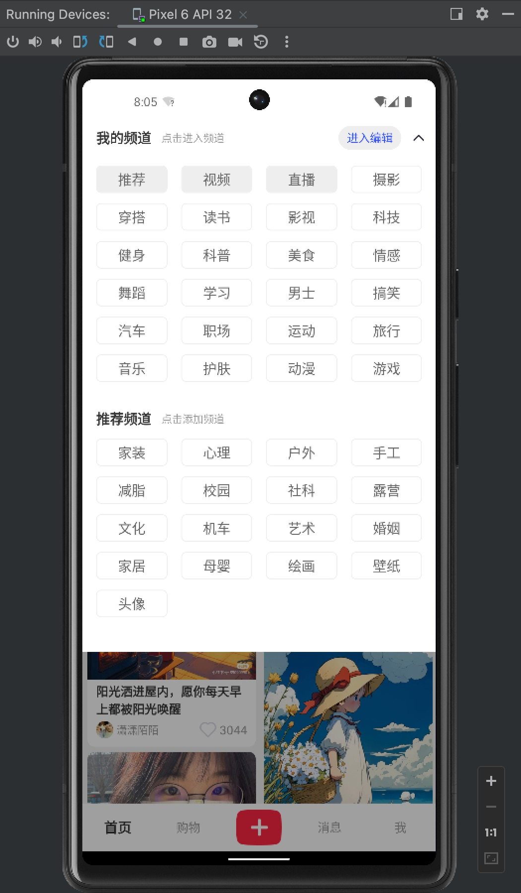
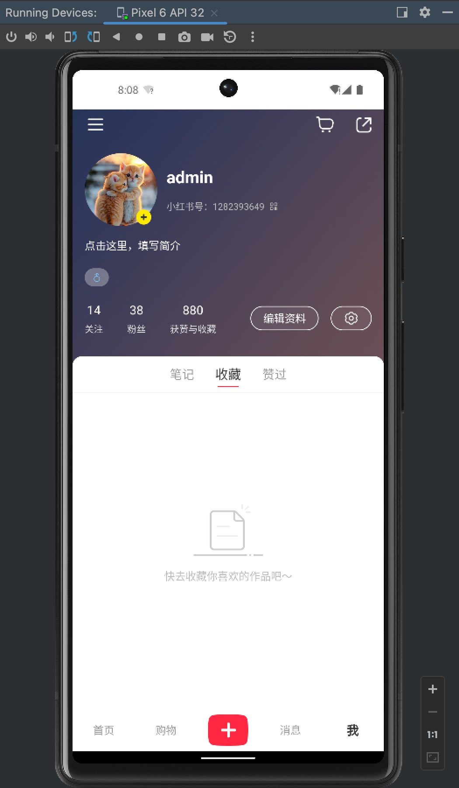
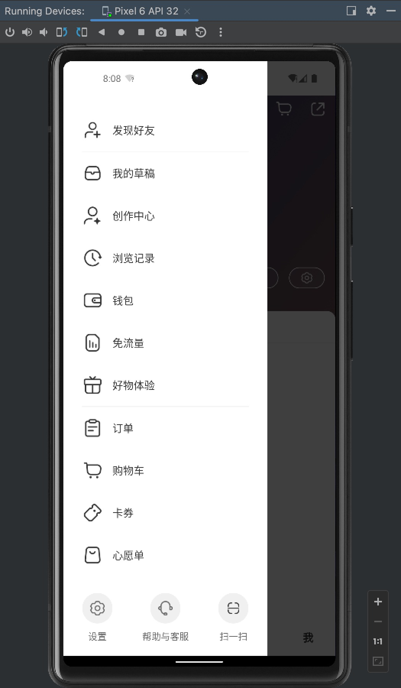

# RedBook

## 技术栈

react native、mobx、async-storage

## server

node、koa、mongodb

## Usage

#### 启动服务端

```shell
cd /koa-server
npm install
npm run dev
```

#### 启动客户端

在项目根目录下运行

```shell
npm install
npm run android
```

## Example Pages

登录页:

- <div align=center>
      
  </div>

- <div align=center>
      
  </div>

首页：

- <div align=center>
      
  </div>

- <div align=center>
      
  </div>

购物：

- <div align=center>
      
  </div>

消息：

- <div align=center>
      
  </div>

我的：

- <div align=center>
      
  </div>

- <div align=center>
      
  </div>
